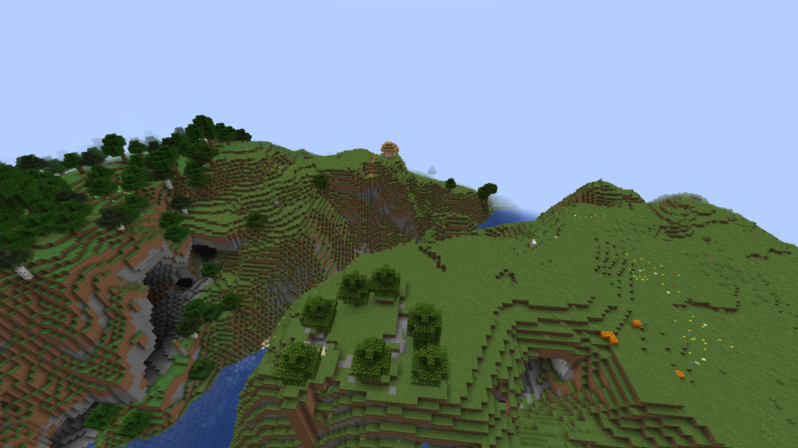

# 📖 Lore of the Emerald Heights

### Era I: The Forgotten Bridges (circa Year 1220 - 1450)
Deep within a stretch of steep, forested highlands and cliffs known today as the **Emerald Heights**, remnants of a forgotten civilization remain. A mysterious, elevated **bridge system**, overgrown yet intact, spans across vast ravines. Scholars believe this bridge was built by the **Orlani**, a pre-villager civilization that once traversed the cliffs. Their methods of construction are lost to time, and their structures have become natural sanctuaries for birds and overgrowth.

The Orlani vanished mysteriously by the year 1450, and no clear signs of their towns or temples remain — only this bridge. Some claim they descended into the caverns beneath the land and were lost to the **Deep Silence**, an era of unexplained subterranean tremors.

### Era II: The Villagers’ Settlement (circa Year 1820 - Present)
Hundreds of years later, **villager communities** began settling the upper plateaus and plains, constructing homes and farming on the grassy expanses. Their villages, nestled among forests and flowers, now dot the cliffsides. The villagers are peaceful and rely on agriculture, trade, and folklore passed down from their ancestors. The **village near the bridge** remains their spiritual center.

Some villagers whisper tales of the Orlani’s return, or a second silence coming from beneath the cliffs.

---

# 🌱 Players' Arrival & Purpose

### Era III: The Founders (Year 2025 Onward)
The year is 2025. A group of adventurers (you, the players) have arrived at Emerald Heights after hearing rumors of both rich land and ancient secrets. The villagers welcomed you cautiously but with hope, for they’ve long awaited skilled hands to help them reclaim and protect their homeland.

You’ve chosen to settle here for three reasons:
1. **The Land is Fertile**: Forests and plains offer wood, food, and space.
2. **The Ruins are Strange**: The Orlani bridges suggest hidden knowledge and technologies.
3. **A Storm is Coming**: Seers in the village speak of a coming **Skyblack**, an unnatural storm foretold to strike within the year, darkening the sun and bringing forth hostile creatures.

As new stewards of this land, your task is to build, explore, and uncover the truth behind these omens.

---

# 🛠️ Immediate Objectives (Deadline: In 7 Minecraft Days)

### 1. **The Watchtower of Orlan's Edge**
**Motivation**: The villagers believe the central cliff plateau once housed a signal tower used by the Orlani.
**Objective**: Build a tall watchtower on top of the highest central plateau. Use stone, wood, and torches. Make it visible from all surrounding cliffs.

### 2. **The Crossroads Farmstead**
**Motivation**: The flat land near the bridge intersection is ideal for food security.
**Objective**: Convert the land near the bridge into a crop farm with fencing and basic irrigation. Use wheat, carrots, potatoes.

### 3. **Map the Villages**
**Motivation**: Multiple villages are seen nearby. Understanding trade routes and distances is key.
**Objective**: Explore and connect all visible villages by path or signage. At least 3 paths must be built.

### 4. **Construct a Council Hall**
**Motivation**: A centralized building for planning, meeting, and protection during storms is essential.
**Objective**: Build a wooden hall at a safe, flat elevation, preferably near the bridge or village. Furnish it with basic interior.

---

# 🌩️ Foretold Event: The Skyblack
According to the villagers’ seers, the **Skyblack** will begin within 20 days. Strange thunder from cloudless skies has already been heard at night.

> “When the bridge’s shadow falls at noon, and wolves howl from the forest's heart, the Skyblack shall descend.”

**Preparation Hint**: This event may bring mobs in unnatural numbers. Fortify structures. Build walls or towers. Light paths. Collect bows and armor.

---

Good luck, Founders of the Heights. Your actions will shape this land’s destiny.
